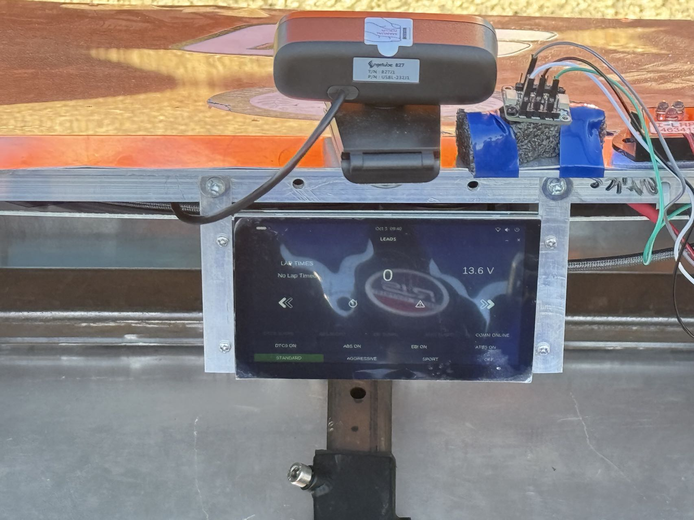
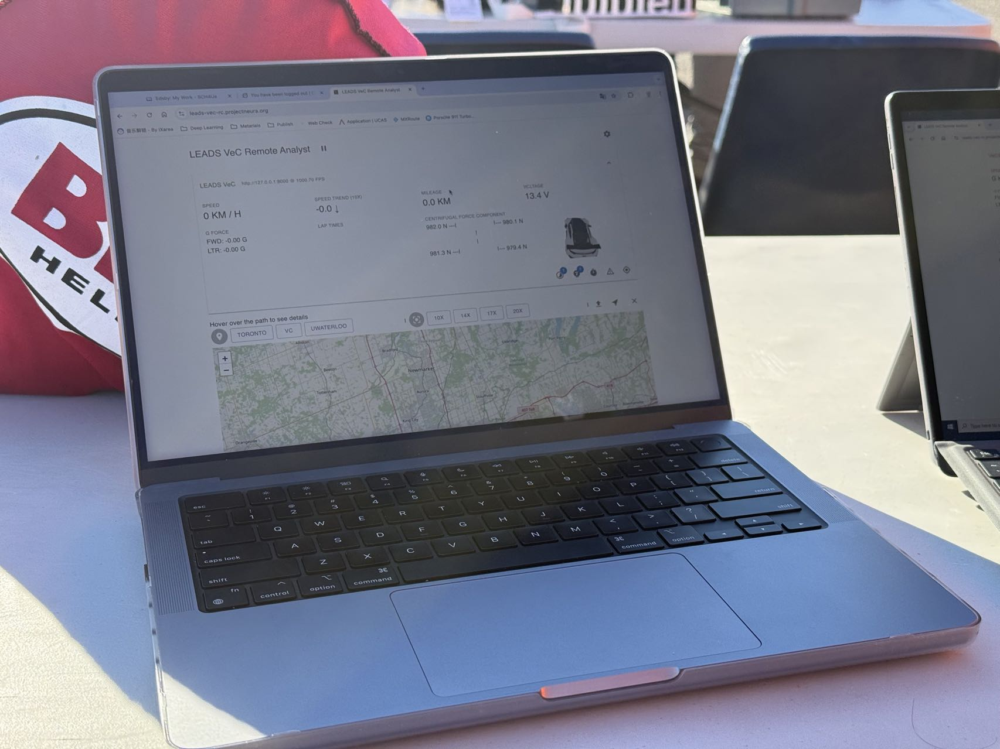

# LEADS: Lightweight Embedded Assisted Driving System


:::{note}

## News

*LEADS: Lightweight Embedded Assisted Driving System* is published on [arXiv](https://arxiv.org/abs/2410.17554) and
ready for open review!

:::

Enable your racing car with powerful, data-driven instrumentation, control, and analysis systems, all wrapped up in a
gorgeous look.

:::{tip}

```shell
pip install leads
```

:::

## How does LEADS Help VeC?

[LEADS VeC](leads_vec) is a template of how we apply LEADS in our team. We strongly recommend you start with it before
using the framework.

VeC99, the first car equipped with LEADS, is a three-wheel rear-drive electric racing car. We have two Arduino Micros as
the power controller and the wheel speed controller. The power controller is responsible for the battery voltage and
pedal positions, whereas the wheel speed controller processes IMU input, as well as pauses from the three hall effect,
switches into wheel speeds. An Orange Pi 5 Pro assembles data from the microcontrollers together with some other GPIO
devices and displays information on a touch screen located under the hood.



A mobile hotspot is used to provide consistent internet connection for the Orange Pi. All raw data is sent to laptops in
the pit crew that have LEADS VeC Remote Analyst running over the public internet through a proxy server that has a
static public IP address. The data frames are then saved in a CSV file on one of the laptops for further analysis. LEADS
VeC Remote Analyst also provides a set of APIs that allow pit crew members intuitively view the status of the vehicle on
the online dashboard.



After that, we run LEADS VeC Data Processor with a customized workflow configuration to review our performance.

## Citation

Should you find our work helpful to you, please cite our publication.

```bibtex
@misc{fu2024leadslightweightembeddedassisted,
    title = {LEADS: Lightweight Embedded Assisted Driving System},
    author = {Tianhao Fu and Querobin Mascarenhas and Andrew Forti},
    year = {2024},
    eprint = {2410.17554},
    archivePrefix = {arXiv},
    primaryClass = {cs.SE},
    url = {https://arxiv.org/abs/2410.17554},
}
```

```{toctree}
:hidden:
:glob:
:caption: 🏎️ LEADS VeC
vec/index.md
vec/user-manual.md
vec/safety-instructions.md
vec/vc.md
```

```{toctree}
:hidden:
:glob:
:caption: ⚡️ Project Thor
thor/index.md
thor/motors.md
thor/backend.md
```

```{toctree}
:hidden:
:glob:
:caption: 🪬 LEADS Jarvis
jarvis/index.md
```

```{toctree}
:hidden:
:glob:
:caption: 🛠️ Framework
context.md
plugin.md
config.md
device.md
logger.md
callback.md
sft.md
comm.md
```

```{toctree}
:hidden:
:glob:
:caption: 🎛️ LEADS Arduino
arduino/index.md
arduino/sketch.md
arduino/input.md
arduino/output.md
```

```{toctree}
:hidden:
:glob:
:caption: 🪟 GUI
gui.md
```

```{toctree}
:hidden:
:glob:
:caption: ⚙️ API
apidocs/index
```
