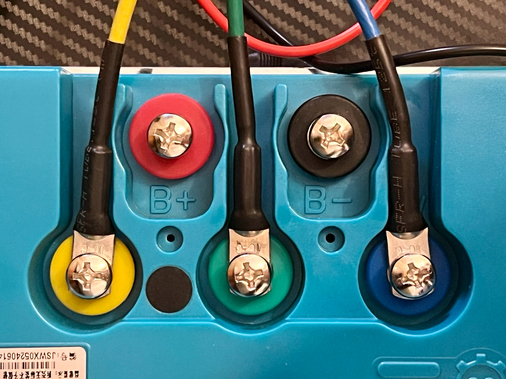

# Motors

Thor supports multi-motor configurations.

## BLDC Motors

We use BLDC (Brushless DC) motors that are supplied to electric bicycles for several reasons, but mainly because they
tend to be more mature and standardized. Such a motor usually comes with a corresponding controller from the same
manufacture.

This image above is an example of the controller. All BLDC controllers should have 5 contacts like it is shown.

| Color               | Usage                         |
|---------------------|-------------------------------|
| Yellow, Green, Blue | 3 phases that go to the motor |
| Red                 | Anode (+)                     |
| Black               | Cathode (-)                   |

The DC power from the backend enters the controller through the anode (red) and leaves through the cathode (black).

Inside the controller, there is an inverter that inverts the DC input into a 3-phase AC output and powers the motor
through the yellow, green, and blue contacts.

### Use as Generators

Interestingly, these 3-phase BLDC motors are widely used in power plants as generators. When it is used as a generator,
it converts mechanical energy, specifically kinetic energy, into electricity, which is exactly the principle of our
kinetic energy recovery system.

When the motor works as a generator, the wiring method remains unchanged, just that now the power flow exits the
controller and feeds the backend through the anode (red) and returns through the cathode (black).

:::{warning}
At any point, if the motor rotates due to an external force, there will be a current back flow. Therefore, the backend
must be capable of handling such scenario.
:::