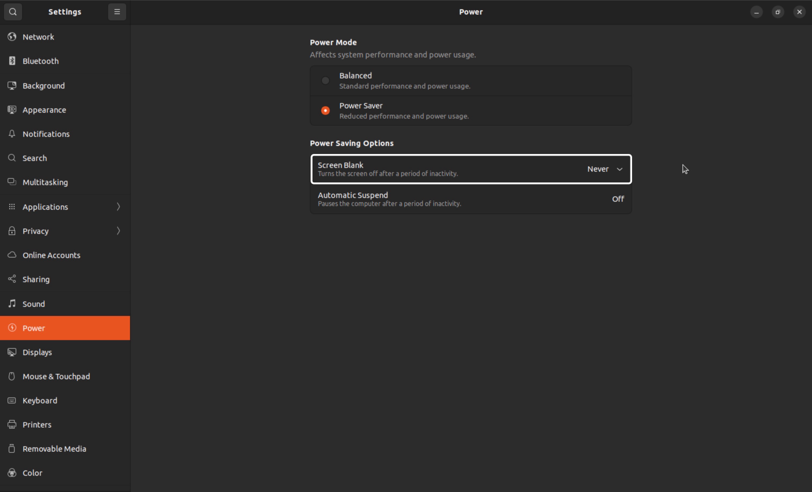

# User Manual

This user manual shall guide you through the whole reproduction process of LEADS VeC.

:::{tip}
This user manual is written in steps in order.
:::

## Connect the Voltage Sensor

The voltage sensor is theoretically a voltage distributor. Connect the two measuring ends with the battery in parallel.


Detailed specs of the voltage sensor can be found in the [Appendix](leads_vec_appendix_power_voltage_sensor).

## Connect the Wheel Speed Sensors

If I can still keep up with the fashion, wheel speed sensors should be 3 or 4 hall switches that each has 3 pins.


You must connect the wheel speed sensors to the designated pins. You can find the pinout diagrams for Arduino in the
[Appendix](leads_vec_appendix_arduino). You do not need all 5 sensors. A three-wheel vehicle would have 3 sensors, and
a four-wheel vehicle would have 4 sensors. Pinout diagrams and input voltage for the hall switches can be found in the
[Appendix](leads_vec_appendix_wheel_speed_controller_wheel_speed_sensor) as well.

| Position          | Pin    |
|-------------------|--------|
| Left Front Wheel  | 2 (D2) |
| Right Front Wheel | 3 (D3) |
| Left Rear Wheel   | 4 (D4) |
| Right Rear Wheel  | 5 (D5) |
| Center Rear Wheel | 6 (D6) |

To configure the power supply modules, see the [Appendix](leads_vec_appendix_power_power_supply_module).

## Install the Operating System for the Raspberry Pi

Download and install the [Raspberry Pi Imager](https://www.raspberrypi.com/software).

It should look similar to this.


Select the "Raspberry Pi Device" accordingly. For the "Operating System", **Ubuntu Desktop 22.04 LTS or later** is
recommended. They are in "Other general-purpose OS".


Select the "Storage" accordingly, then click "NEXT".

If a dialog like the one below pops up, just say yes.


From then on, wait until this dialog shows up.


Click "CONTINUE" and make sure the SD card has been **successfully ejected** before you remove it.

Insert the SD card to the Raspberry Pi and power up. Follow the instructions to install the system.

:::{warning}
The installation is very likely to fail if you do not eject the SD card properly, or you click "Continue" too soon
before Wi-Fi is fully connected (you will see during the installation process on the Raspberry Pi).
:::

## (Install the Operating System for the Orange Pi)

Download the OS image for your device [here](https://joshua-riek.github.io/ubuntu-rockchip-download/). **Ubuntu Desktop
22.04 LTS or later** is recommended.

Extract the XZ compressed package you downloaded into a folder where a file that ends with ".img" should be there.

Download and install the [balenaEtcher](https://etcher.balena.io).

It should look similar to this.


Click "Flash from file" and choose the image file.

Select the target accordingly, then click "Flash!".

It will run a validation after flashed, then you are safe to unplug the SD card. If the validation fails, it is most
likely because you selected the XZ file as the target instead of the uncompressed content.

Insert the SD card to the Orange Pi and power up. Follow the instructions to install the system.

## Environment Setup

You may also find references [here](https://github.com/ProjectNeura/LEADS?tab=readme-ov-file#environment-setup).

:::{tip}
If you encounter "permission denied" errors, grant root permission.

```shell
sudo su
```

:::

### Install LEADS

Follow [this](https://github.com/ProjectNeura/LEADS?tab=readme-ov-file#leads) section to install everything.

If success, you should see a similar output.

```shell
[Level.INFO: 1] [<module>] [2024-05-11 20:32:26.899024] LEADS VeC
System Kernel: ...
Python Version: ...
User: ...
`frpc` Available: ...
Module Path: ...
LEADS Version: ...
LEADS VeC Version: ...
```

### (Environment Variable)

If you are using an Orange Pi, you have to set the environment variable. See
[here](https://github.com/ProjectNeura/LEADS?tab=readme-ov-file#gpiozero-compatibility).

### Register LEADS VeC

```shell
leads-vec -r systemd run
```

```shell
systemctl --user daemon-reload
systemctl --user enable leads-vec
```

:::{warning}
Always use explicit startup until deployment. The logging information may not be seen in implicit mode. Stop the service
during setup.

```shell
systemctl --user stop leads-vec
```

:::

### (Environment Variable)

If you are using an Orange Pi, you have to edit the service script. See
[here](https://github.com/ProjectNeura/LEADS?tab=readme-ov-file#gpiozero-compatibility).

### Install FRP (Optional)

Follow [this](https://github.com/ProjectNeura/LEADS?tab=readme-ov-file#frp) section to install FRP.

Should you have membership in the VeC Project, please ask your contact for the FRP server credentials.

### Enable FRP (Optional)

Once you have FRP installed, enable it in the Systemd service by editing the service script that can usually be found at
"/usr/local/leads/venv/python3.12/site-packages/leads_vec/_bootloader/leads-vec.service.sh".

### Reboot

Reboot the Raspberry Pi to apply changes.

```shell
reboot
```

When it starts again, you should see LEADS VeC automatically running.

## Ubuntu Settings

:::{tip}
These settings can possibly be found in various locations depending on the specific system version.
:::

To prevent the screen blanks off in the middle of driving, you should set "Screen Blank" to "Never".



To improve the experience, it is recommended to enable "Auto-hide the Dock".


## Configurations

To properly configure LEADS VeC, you will need to create a configuration file. Since the Systemd service uses
"/usr/local/leads/config.json" by default, it is recommended to use the same. Otherwise, make sure you refer to the
correct file anywhere LEADS VeC starts.

If you have correctly set up the environment, the file should already exist. Edit it using Vim.

:::{tip}
Install Vim first if it is not bundled with the system.

```shell
apt install -y vim
```

:::

```shell
vim /usr/local/leads/config.json
```

Press <kbd>I</kbd> to enter insert mode.

:::{tip}
To save and quit, press <kbd>Esc</kbd> and type in ":wq", then press <kbd>Enter</kbd>.
:::

For racing, daily test drives, and debugging, there are different configurations for each.

You may also add optional configurations. Learn more about the configurations
[here](https://github.com/ProjectNeura/LEADS?tab=readme-ov-file#configurations).

### Racing

```json
{
  "manual_mode": true,
  "fullscreen": true,
  "w_debug_level": "ERROR",
  "front_wheel_diameter": 20,
  "rear_wheel_diameter": 26
}
```

### Daily Test Drives

```json
{
  "fullscreen": true,
  "refresh_rate": 60,
  "w_debug_level": "WARN",
  "front_wheel_diameter": 20,
  "rear_wheel_diameter": 26
}
```

### Debugging

```json
{
  "fullscreen": true,
  "refresh_rate": 60,
  "front_wheel_diameter": 20,
  "rear_wheel_diameter": 26
}
```

### Determine Devices' Ports

Sometimes the ports may differ due to various hardware layouts. You can determine the port using the described
procedure.

1. Remove all USB devices
2. Plug in one device
3. List current ACM ports
   ```shell
   ls /dev/ttyACM*
   ```
   If no port is found, try AMA ports.
   ```shell
   ls /dev/ttyAMA*
   ```
4. Set the device to the newly appeared port
5. Repeat steps 2 to 4 for other devices

If you see "permission denied", apply this command to the corresponding device.

The dynamic symbol changes on every reboot. A more persistent identifier can be acquired through the following command.

```shell
ls -l /dev/serial/by-id/
```

For example, if the dynamic symbol has been determined to be "/dev/ttyACM0", you will find something similar to
`usb-FTDI_FT232R_USB_UART_AI03AC70-if00-port0 -> /dev/ttyACM0`.

## Update LEADS

```shell
pip-leads install --upgrade leads
```

## Start the Program

:::{warning}
Running as root is not recommended.
:::

The program should automatically start if it is correctly configured. If not, use the following command.

```shell
leads-vec -c /usr/local/leads/config.json run
```

## Fault Lights

See comments in "[devices.py](#leads_vec.devices)".

## Shortcuts

| Key            | Usage               |
|----------------|---------------------|
| <kbd>1</kbd>   | Turn on / off DTCS  |
| <kbd>2</kbd>   | Turn on / off ABS   |
| <kbd>3</kbd>   | Turn on / off EBI   |
| <kbd>4</kbd>   | Turn on / off ATBS  |
| <kbd>T</kbd>   | Time a lap          |
| <kbd>Tab</kbd> | Toggle debug window |

## Debug

If you run into any error, first search in the existing [issues](https://github.com/ProjectNeura/LEADS/issues). If it
has not been encountered, please post a new issue.